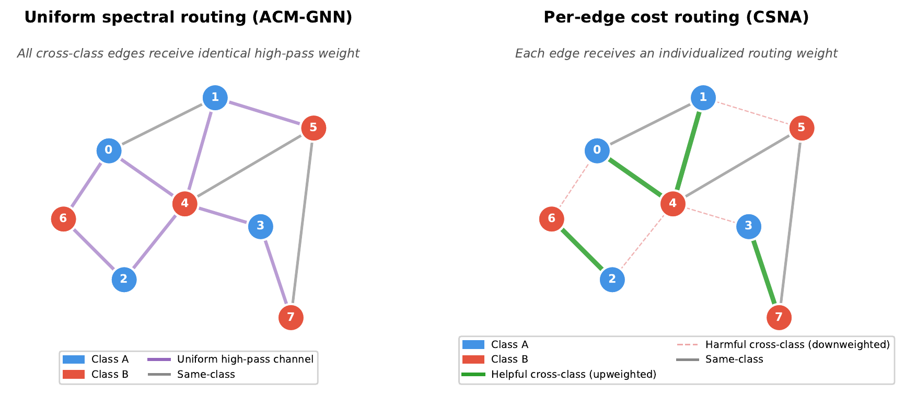

# CSNA: Cost-Sensitive Neighborhood Aggregation for Heterophilous Graphs — When Does Per-Edge Routing Help?

This repository contains the official implementation of the paper:

> **Cost-Sensitive Neighborhood Aggregation for Heterophilous Graphs: When Does Per-Edge Routing Help?**
> Eyal Weiss, Technion -- Israel Institute of Technology
> arXiv preprint, 2026

Graph Neural Networks (GNNs) learn from data organized as networks — social graphs, molecules, citation networks. They work by aggregating information from neighboring nodes, but this fails when connected nodes tend to belong to *different* classes (a property called *heterophily*). CSNA addresses this by measuring how different each pair of connected nodes is and routing their messages through separate processing channels depending on whether they appear similar or dissimilar.

Recent work distinguishes two heterophily regimes: *adversarial*, where cross-class edges harm classification, and *informative*, where they carry useful structural signal. We introduce CSNA, a method that computes pairwise distance in a learned projection and uses it to soft-route messages through **concordant** and **discordant** channels with independent transformations. CSNA's per-edge routing succeeds on adversarial-heterophily datasets but fails on informative-heterophily datasets — a pattern that operationalizes the regime distinction and reveals when per-edge routing helps.



**Left:** ACM-GNN applies a uniform high-pass filter to all cross-class edges. **Right:** CSNA assigns individualized routing weights, upweighting helpful cross-class edges and downweighting harmful ones.

## Main Results

Node classification accuracy (%) on heterophily benchmarks. All methods tuned over the same hyperparameter grid. Best in **bold**, second-best in *italics*. Many differences are within one standard deviation; we focus on patterns rather than strict mean rankings.

| Method | Texas (H=0.09) | Wisconsin (H=0.19) | Cornell (H=0.13) | Actor (H=0.22) | Chameleon (H=0.23) | Squirrel (H=0.22) |
|:---|:---:|:---:|:---:|:---:|:---:|:---:|
| MLP | 77.3 ± 4.6 | **83.7 ± 4.8** | *72.2 ± 3.6* | 35.0 ± 1.4 | 51.9 ± 1.8 | 34.8 ± 1.4 |
| GCN | 55.7 ± 9.9 | 50.6 ± 8.5 | 47.0 ± 8.7 | 27.3 ± 1.4 | **67.3 ± 1.7** | **53.4 ± 0.8** |
| GAT | 50.8 ± 9.8 | 51.4 ± 7.8 | 47.3 ± 5.8 | 28.0 ± 1.4 | 65.7 ± 2.2 | 50.4 ± 1.4 |
| GraphSAGE | 76.5 ± 6.8 | 75.9 ± 5.8 | 66.2 ± 7.7 | 34.1 ± 0.6 | 63.9 ± 2.1 | 45.8 ± 1.4 |
| H2GCN | **81.9 ± 4.2** | *82.4 ± 5.8* | *72.2 ± 4.2* | 35.6 ± 0.9 | 56.8 ± 2.7 | 35.0 ± 1.3 |
| GPRGNN | *77.8 ± 6.9* | 75.7 ± 7.7 | 58.6 ± 9.9 | **36.0 ± 0.8** | 65.0 ± 2.1 | 43.6 ± 1.8 |
| ACM-GNN | 77.3 ± 8.2 | 78.0 ± 4.4 | 68.6 ± 7.2 | 35.3 ± 1.2 | *65.9 ± 2.9* | *51.0 ± 1.8* |
| **CSNA (ours)** | 77.0 ± 8.3 | 79.6 ± 6.2 | **72.7 ± 4.3** | *35.7 ± 1.2* | 54.6 ± 2.7 | 37.8 ± 1.9 |

CSNA is competitive on adversarial-heterophily datasets — statistically tied for first on Cornell and Actor, within one standard deviation of the best on Texas and Wisconsin — while underperforming on informative-heterophily datasets (Chameleon, Squirrel), where uniform spectral filters (ACM-GNN) and standard aggregation (GCN) better preserve the useful heterophilous signal. See the paper for detailed analysis.

## For Students

If you are an undergraduate or early graduate student reading the paper, we recommend also reading the **[Technical Companion](paper/technical_companion.pdf)** — a self-contained guide that explains every equation and technical concept in detail, assuming only undergraduate-level linear algebra, probability, and graph theory. No prior knowledge of GNNs is required.

## Installation

```bash
pip install torch torch_geometric numpy scipy scikit-learn matplotlib
```

See [PyTorch Geometric installation](https://pytorch-geometric.readthedocs.io/en/latest/install/installation.html) for platform-specific instructions.

## Project Structure

```
src/
├── models/
│   ├── csna.py          # CSNA full model (g + h, extended variant)
│   ├── csna_v2.py       # CSNA lite model (g only, paper default)
│   └── baselines.py     # Baselines (GCN, GAT, GraphSAGE, H2GCN, GPRGNN, ACM-GNN, MLP)
├── experiments/
│   ├── run_experiments.py          # Core functions (data loading, evaluation, model builder)
│   ├── run_fair_experiments.py     # Fair tuning protocol (Table 1: MLP, GCN, GAT, GraphSAGE, CSNA)
│   └── run_faithful_baselines.py   # Faithful baselines (Table 1: H2GCN, GPRGNN, ACM-GNN)
├── figures/                        # Scripts to generate paper figures
└── utils/
    └── count_params.py             # Parameter count comparison
```

Datasets are downloaded automatically by PyTorch Geometric on first run.

## Usage

### Quick Start

```python
import sys; sys.path.insert(0, 'src')  # run from repo root
from models.csna_v2 import CSNA  # lite model (paper default)

model = CSNA(
    in_channels=1703,       # Input feature dimension
    hidden_channels=64,     # Hidden layer dimension
    out_channels=5,         # Number of classes
    num_layers=2,           # Number of CSNA layers
    tau=1.0,                # Temperature for concordance routing
    dropout=0.5,
    sample_ratio=1.0,       # No edge sampling (default for paper results)
)

# Forward pass (standard PyG interface)
out = model(data.x, data.edge_index)  # [num_nodes, num_classes]
```

### Reproducing Results

All commands should be run from `src/experiments/`.

```bash
cd src/experiments

# Step 1: Run CSNA and standard baselines (MLP, GCN, GAT, GraphSAGE)
python run_fair_experiments.py

# Step 2: Run faithful heterophily baselines (H2GCN, GPRGNN, ACM-GNN)
python run_faithful_baselines.py
```

Results are saved to `results/results_v2.json` and `results/faithful_baselines.json`.

### Extended Variant (g + h)

The extended variant adds a learned cost component h_ij beyond the observed divergence g_ij. In our experiments, this did not provide a consistent advantage over the default (g_ij only) and risks overfitting on small datasets, but it may be useful in other settings:

```python
from models.csna import CSNA  # full model with h_ij

model = CSNA(
    in_channels=1703,
    hidden_channels=64,
    out_channels=5,
    tau=1.0,
)
```

## Citation

```bibtex
@article{weiss2026csna,
  title={Cost-Sensitive Neighborhood Aggregation for Heterophilous Graphs: When Does Per-Edge Routing Help?},
  author={Weiss, Eyal},
  journal={arXiv preprint},
  year={2026}
}
```

## Note on Softmax Normalization

CSNA normalizes concordance weights per source node (`edge_index[0]`), meaning each node distributes its outgoing influence uniformly. This differs from the more common per-destination normalization (`edge_index[1]`). We tested both variants with full hyperparameter tuning on Texas, Wisconsin, and Cornell and found no consistent accuracy difference across datasets (differences within standard deviation and typical tuning variance). The code includes a comment indicating how to switch to per-destination normalization if desired.

## Note on Baselines

H2GCN, GPRGNN, and ACM-GNN are implemented faithfully following the original papers and official repositories:
- **H2GCN**: exact non-ego 2-hop neighborhoods, concatenation of all intermediate representations. Based on [GitEventhandler/H2GCN-PyTorch](https://github.com/GitEventhandler/H2GCN-PyTorch).
- **GPRGNN**: gcn_norm propagation with self-loops, learnable polynomial coefficients. Based on [jianhao2016/GPRGNN](https://github.com/jianhao2016/GPRGNN).
- **ACM-GNN**: full attention mechanism with per-channel projection and mixing matrix. Based on [SitaoLuan/ACM-GNN](https://github.com/SitaoLuan/ACM-GNN).

Standard baselines (GCN, GAT, GraphSAGE, MLP) use PyTorch Geometric layers. All models are tuned over the same hyperparameter grid for fair comparison.

## Author

**Eyal Weiss**
Computer Science Faculty, Technion -- Israel Institute of Technology
[eweiss@campus.technion.ac.il](mailto:eweiss@campus.technion.ac.il)

## License

MIT License. See [LICENSE](LICENSE) for details.
